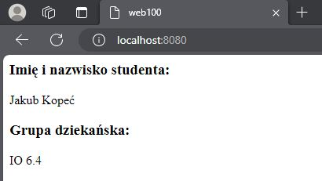
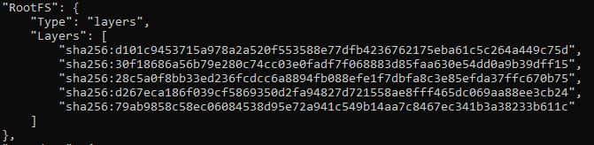
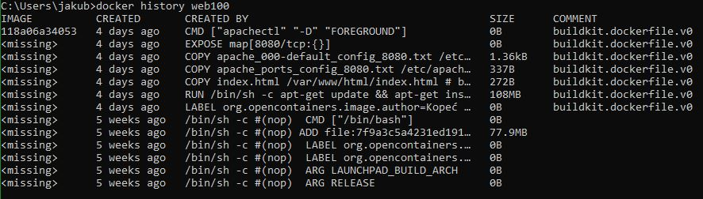

# docker-lab-4-dockerfile

Example usage of Dockerfile in configuration of Apache server on ubuntu with Apache running on custom port and with custom welcome page.

## Table of Contents

- [Requirements](#requirements)
- [Image Building](#image-building)
- [Container Setup and Running](#container-setup-and-running)
- [Image Layers](#image-layers)

## Requirements

For Linux and Windows systems Docker or Docker Desktop installed and running.

For Windows systems WSL installed.

## Image Building

Example for Windows:

Download files and open console in location where these files are stored.

```cmd
cd C:\location\of\downloaded\files\
```

If you want to change Apache welcome page content you can edit index.html file.

If you want to change current port Apache working on you have to edit apache_000-default_config_8080.txt and apache_ports_config_8080.txt files. For now port 8080 is set instead of 80. If you want to set up different port you have to change port 8080 to desired port. Remember to change it only in places where port 8080 is set. Other ports are for ssl, etc.

Then run command to build new image with Dockerfile named web100:

```cmd
docker build -t web100 .
```

## Container Setup and Running

To create container with web100 image you need to specify modes it will run with (-d in this case), ports (-p portOnYourHostMachine:PortOnApacheServer(8080 default for this image)), name of container (--name web100container in this case) and any additional options you will need. Example command below.

```cmd
docker run -d -p 8080:8080 --name web100container web100
```

After that you can access Apache server working on running container through port 8080 in this case. Just type in search bar localhost:8080.



If you want to stop running container:

```cmd
docker stop web100container
```

If you want to start not running but previously created container:

```cmd
docker start web100container
```

## Image Layers

To specify how much layers our image has we need to execute command:

```cmd
docker inspect web100
```

and look for node RootFS where layers are listed like this:



In this case we got 5 layers. To specify what actions are responsible for creation of certain layers we need to execute another command:

```cmd
docker history web100
```

and look for lines where size in SIZE column is larger than 0B because only layers larger than 0B are considered as layers.

Result of previous command:



Looking at layers with size larger than 0B we need to look at CREATED BY column. There are informations about what commands are responsible for certain layers.

